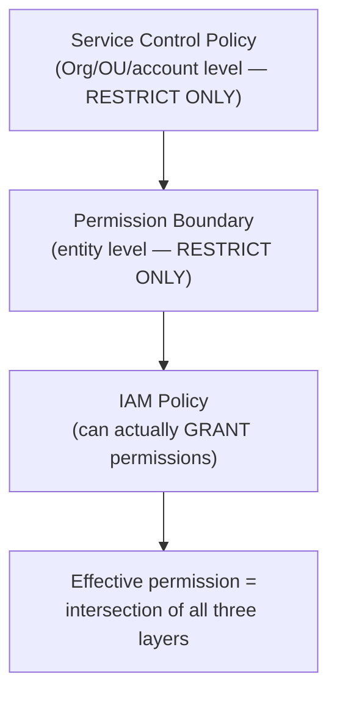

# IAM & identity architecture

## The one-line hook

> **Effective permission on AWS is never just "what does this one policy say" — it's the intersection of every guardrail layered on top of it: the policy itself, any permission boundary, and any Service Control Policy above that. Missing one layer of that stack is the single most common real IAM mistake.**

## Users, Roles, and the rule that matters most

- **IAM Users** carry long-lived, persistent credentials.
- **IAM Roles** provide **temporary** credentials, assumed by a person or a service for a limited session.

The strong, near-universal senior guidance: **never use IAM users for applications** — always use roles. A role's temporary credentials expire automatically and can't be leaked in the same lasting way a hardcoded long-lived access key can.

## Policy evaluation — the logic that decides what actually happens

- **Explicit deny always wins**, no matter how many allow statements exist elsewhere.
- **No matching statement at all defaults to implicit deny** — AWS IAM is default-deny, not default-allow.
- **Least privilege**: policies should be scoped to specific resources and actions, not broad wildcards, and **managed policies** (reusable, centrally maintained) are preferred over ad hoc inline policies for consistency across an organization.

## The layered guardrail model — where most real mistakes happen

| Layer | Scope | Can it grant permissions? |
|---|---|---|
| **IAM Policy** | Attached to a specific user/role | Yes — this is the only layer that actually grants anything |
| **Permission Boundary** | A specific IAM entity's maximum ceiling | No — restricts only |
| **Service Control Policy (SCP)** | An entire AWS Organizations account or OU | No — restricts only |

**The critical, easy-to-get-wrong detail**: **SCPs can only restrict, never grant.** An SCP that denies a service at the account level means no IAM policy inside that account — however permissive — can ever override it. Permission boundaries work the same way, one level down, scoped to a specific entity rather than a whole account. **Effective permission is always the intersection of every applicable layer**, never just what the most visible policy happens to say.

**Memorable hook:** *"IAM policies are the only layer that can say yes. Permission boundaries and SCPs can only ever say 'no, not even if something else says yes' — they're ceilings, not grants."*

## AWS Organizations and Control Tower — governance at scale

**AWS Organizations** structures multiple accounts hierarchically: **Organization Root → Organizational Units (OUs) → Accounts**, with consolidated billing and SCPs applicable at any level of that hierarchy. **AWS Control Tower** automates standing up a proper **landing zone** on top of Organizations — multi-account structure, baseline guardrails, centralized logging, identity federation, and automated account vending — with a specific, concrete rule of thumb worth citing directly: **use it once you have more than 3-4 AWS accounts**, since manually replicating consistent guardrails across that many accounts by hand becomes its own real operational risk.

## IAM Identity Center — federated access, and a direct callback to Day 3

**IAM Identity Center** (formerly AWS SSO) provides centralized, federated access across every account in an organization, integrating with an external identity provider — directly recalling **Day 3's OIDC/SAML material**. This is exactly the tool that would connect a Thai enterprise customer's existing LDAP or Active Directory to AWS account access, the same enterprise identity integration pattern already covered for Kong and OpenShift earlier this week, just applied to AWS account access specifically.

## Zero Trust on AWS — the current, sophisticated framing

- **Identity-centric access**: IAM roles everywhere, no long-lived credentials, MFA enforced, IAM Identity Center for federated access.
- **Least privilege at scale**: SCPs as guardrails, **IAM Access Analyzer** for continuous, automated review of actual granted access rather than a one-time audit.
- **Network microsegmentation**: per-workload Security Groups (never shared broadly across unrelated workloads), **VPC Lattice** for service-to-service authentication and authorization, **PrivateLink** for reaching AWS services without internet exposure.
- **Continuous verification**: **AWS Verified Access** for VPN-less, continuously-verified application access, rather than a one-time perimeter check at connection time.

## Real-world examples

1. **A multi-account AWS Organizations setup for a Thai enterprise customer** — separate prod/staging/dev/shared-services accounts, SCPs enforcing account-level guardrails, Control Tower automating the landing zone — directly matches the research-identified "senior architect governance answer," and is a realistic, credible recommendation grounded in your Red Hat/Kong enterprise account experience.
2. **IAM Identity Center federating access using a customer's existing LDAP/Active Directory**, a direct, explicit callback to Day 3's OIDC/enterprise identity material — the same underlying integration pattern, just applied to AWS account access.
3. **Correcting the dangerous assumption that a managed service like RDS is automatically secure.** Security group rules, IAM permissions, subnet placement, and encryption configuration remain the customer's responsibility even for a fully-managed database — a specific, real trap worth naming directly here, and a direct forward-reference to the Shared Responsibility Model page later today.
