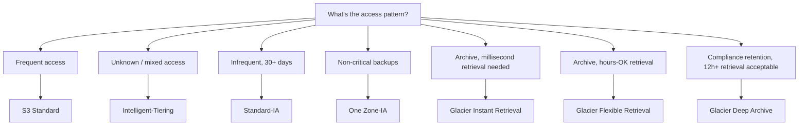

# S3 deep dive

Research was unusually specific about what separates a junior S3 answer from a senior one — this whole page is built around making sure you consistently give the second kind.

## The one-line hook

> **"S3 is cheap and durable" is the junior answer. "S3 Standard for the first 30 days, then lifecycle to Glacier Deep Archive, accepting a 12-hour retrieval SLA for the cost savings" is the senior one — the entire difference is a stated, specific trade-off.**

## Durability and consistency, precisely

S3 stores data redundantly across a **minimum of three Availability Zones** within a region by default, giving its famous eleven-nines durability figure — this redundancy is automatic, not something you configure. On consistency: S3 now provides **strong read-after-write consistency** for all operations (a change from years ago when S3 was documented as eventually consistent) — worth stating precisely, since older material or an out-of-date assumption here is an easy, checkable mistake.

## Storage classes — the decision tree, not just a list

| Class | Fit |
|---|---|
| **Standard** | Frequently accessed data |
| **Intelligent-Tiering** | Unknown or mixed access patterns — automatically moves objects between tiers with no retrieval fees for doing so |
| **Standard-IA** | Infrequent access, but needed within 30+ day windows |
| **One Zone-IA** | Non-critical backups where losing an entire AZ's copy is an acceptable risk, in exchange for a lower price |
| **Glacier Instant Retrieval** | Archived data still needing millisecond retrieval |
| **Glacier Flexible Retrieval** | Archive where an hours-long retrieval wait is acceptable |
| **Glacier Deep Archive** | The cheapest tier — compliance retention where a 12+ hour retrieval SLA is genuinely acceptable |

**The senior move is combining this table with a lifecycle policy** — automatically transitioning objects through these tiers over time based on age, rather than manually picking one class forever. This is precisely the concrete example research repeatedly flagged as the actual senior/junior differentiator.

## Security — the layered checklist

- **Block Public Access** — enforced at both the account and bucket level.
- **Bucket policies and IAM policies** — least privilege, scoped narrowly.
- **VPC Endpoint** — directly recalling Day 6's VPC page: routing S3 traffic through a free Gateway Endpoint keeps it off the public internet and avoids NAT Gateway charges.
- **Encryption at rest** — SSE-S3 (S3-managed keys) or SSE-KMS (customer-managed keys via AWS KMS, giving more granular control and audit trail over key usage).
- **Enforce HTTPS** — via an explicit bucket policy denying non-TLS requests.
- **MFA Delete** — requires multi-factor authentication to permanently delete an object version, on critical buckets.
- **Versioning plus S3 Object Lock** — genuine ransomware and accidental-deletion protection, covered in depth below.
- **CloudTrail data events** — object-level API audit logging, beyond CloudTrail's default account-level activity logging.

## Versioning, MFA Delete, and Object Lock — worth understanding together

- **Versioning** keeps every prior variant of an object, protecting against accidental overwrite or deletion — nothing is truly gone, just superseded.
- **MFA Delete** raises the bar specifically for *permanently* removing a version, requiring active MFA confirmation.
- **S3 Object Lock** provides genuine **WORM (Write Once, Read Many)** compliance — an object under lock literally cannot be deleted or overwritten for its retention period, **even by an account administrator**. This is directly relevant to regulated retention requirements in a Thai financial-services context, where "even an admin can't delete this early" is often a genuine compliance requirement, not just a nice-to-have.

**Memorable hook:** *"Versioning protects against a mistake. MFA Delete protects against a mistake that also had valid credentials. Object Lock protects against someone with valid credentials and full admin rights, deliberately or under duress — a materially higher bar, and the one regulated compliance retention actually needs."*

## Replication — automatic within-region durability vs. deliberate cross-region choice

S3's multi-AZ replication (minimum 3 AZs) happens **automatically** as part of normal durability — you don't configure it. **Cross-Region Replication (CRR)** is a **separate, deliberate architecture decision** layered on top, chosen specifically for disaster recovery, regulatory data residency requirements, or reducing read latency for geographically distant consumers — worth being clear this is opt-in, not something S3 already does for you by default.

## Transfer Acceleration — a specific, narrow use case

**S3 Transfer Acceleration** routes uploads through CloudFront edge locations to speed up transfers specifically **from geographically distant locations** — a targeted fix for a specific latency problem, not a general-purpose performance setting.

## Real-world examples

1. **The literal senior-differentiator example, applied as a real recommendation**: for a Thai financial customer's compliance document retention, S3 Standard for the first 30 days of active use, then a lifecycle policy transitioning to Glacier Deep Archive with Object Lock enabled for WORM compliance, explicitly accepting the 12-hour retrieval SLA — a complete answer combining storage classes, lifecycle policies, and compliance features into one coherent, specific recommendation.
2. **Using a VPC Gateway Endpoint for S3**, directly recalling this same day's VPC networking page, to keep S3 traffic entirely off the public internet for a security-conscious customer.
3. **Recommending Cross-Region Replication as a deliberate DR layer**, explicitly distinct from S3's automatic within-region multi-AZ durability — a precise, technically accurate framing rather than conflating the two.
