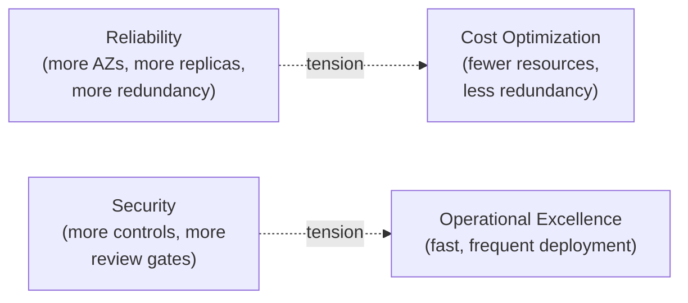

# The Well-Architected Framework, all 6 pillars

## The one-line hook

> **The Well-Architected Framework isn't a checklist to maximize on every pillar simultaneously — the pillars actively conflict with each other, and the actual skill being tested is making a conscious, defensible trade-off between them, not scoring well on all six at once.**

## The six pillars

| Pillar | Core question | Concrete AWS services |
|---|---|---|
| **Operational Excellence** | Can you run and monitor this reliably, and improve it safely over time? | CI/CD (CodePipeline), Infrastructure as Code (CloudFormation, Terraform), CloudWatch monitoring, small/frequent/reversible changes |
| **Security** | Is access, data, and infrastructure protected at every layer? | IAM least privilege, WAF, KMS encryption, CloudTrail/GuardDuty/Config for detection |
| **Reliability** | Does the system recover from failure and meet its availability target? | Multi-AZ, Auto Scaling Groups, RDS Multi-AZ, eliminating single points of failure, **testing recovery procedures** |
| **Performance Efficiency** | Are you using the right resources efficiently for the workload's actual needs? | Right-sized EC2 instance types, CloudFront, ElastiCache, serverless where it fits |
| **Cost Optimization** | Is spend matched to actual value delivered, without waste? | Right purchasing model (Reserved/Savings Plans/Spot), eliminating idle resources, matching supply to demand |
| **Sustainability** | Is environmental impact minimized? | Maximizing utilization of provisioned resources, favoring managed/serverless services, region selection where compliance allows |

**The Sustainability pillar is the newest addition** — worth stating plainly, since a meaningful amount of older prep material still only lists five. Its core insight is worth internalizing, not just naming: AWS operates its infrastructure at a scale and utilization efficiency most individual customers can't match on self-managed hardware, so **choosing managed or serverless services is often simultaneously a cost, operational, and sustainability win** — the same architectural decision serving three pillars at once.

## The genuinely senior insight: the pillars are in tension

A candidate who lists all six pillars and connects each to a service is doing fine, but not yet senior. The actual differentiator research repeatedly pointed to: **understanding that these pillars actively pull against each other**, and being able to articulate which one you're consciously prioritizing, and why, for a specific workload.

- **Reliability vs. Cost**: maximum reliability (many AZs, cross-region replicas, generous redundancy) costs real money — a non-critical internal tool doesn't need the same reliability investment as a customer-facing payment system, and pretending otherwise wastes budget without adding real business value.
- **Security vs. Operational Excellence**: heavier security review gates and controls can genuinely slow deployment velocity — the right balance depends on the actual risk profile of what's being shipped, not a universal maximum-security default applied everywhere regardless of stakes.

**Memorable hook:** *"Reciting all six pillars is table stakes. Saying 'for this specific workload, I'm consciously trading some Cost Optimization for Reliability, and here's exactly why the business requirement justifies it' is the senior answer."*

## The AWS Well-Architected Tool — where this actually gets applied

Worth naming as more than an abstract framework: the **AWS Well-Architected Tool** provides a formal, structured review process — walking through each pillar's specific questions against a real workload, documenting identified risks, and tracking remediation over time. This is the concrete mechanism by which the framework gets applied in practice, not just a set of principles referenced in a slide deck.

## Real-world examples

1. **Connecting the Reliability pillar's "test recovery procedures" directly to Day 5's Chaos Engineering material** — this is literally the same idea, expressed as a formal Well-Architected pillar requirement rather than a standalone practice. A strong, explicit, unprompted cross-day connection.
2. **A genuine, honest trade-off recommendation**: a simpler, lower-cost, single-AZ setup for a non-critical internal tool, contrasted directly with a multi-region Aurora Global Database (from the previous page) for a customer's core transaction system where Reliability genuinely outweighs Cost Optimization — demonstrating the "pillars in tension" sophistication with a real, concrete pair of examples rather than an abstract statement.
3. **Recommending serverless/managed services partly on Sustainability grounds** — noting explicitly that AWS's economies of scale typically achieve better hardware utilization, and therefore lower carbon footprint per unit of actual work performed, than a customer's own over-provisioned self-managed infrastructure — a current, specific, easy-to-overlook detail worth having ready.
