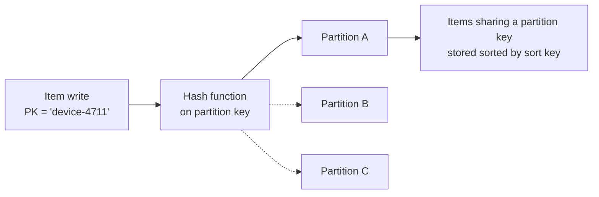

# DynamoDB deep dive & the SQL vs NoSQL decision

The previous page closed with a two-row decision framework and the honest admission that it wasn't a full DynamoDB treatment. This page is that treatment — because "when would you use DynamoDB instead of RDS?" is one of the most reliably asked AWS SA questions, and the follow-ups ("how do you key it?", "what's a hot partition?") separate people who have read the brochure from people who could actually design the table.

## The one-line hook

> **Relational databases let you design around your data and figure out the queries later. DynamoDB makes you design around your queries — know every access pattern first, then build the table to serve exactly those. Get that backwards and no amount of provisioned capacity will save you.**

## What DynamoDB actually is

**Amazon DynamoDB** is a fully managed, serverless key-value and document database delivering **single-digit-millisecond** performance at essentially any scale, with data automatically replicated across three Availability Zones. There are no instances to size, no engines to patch, no storage to pre-provision — the operational surface is the table, its keys, and its capacity mode. That's the whole appeal: predictable latency that stays flat whether the table holds a gigabyte or a hundred terabytes.

## Partitioning — where the performance comes from, and where it goes wrong

- The **partition key** is hashed to decide which physical partition stores the item; the optional **sort key** orders all items sharing that partition key, enabling range queries ("all readings for device-4711 between these timestamps").
- Each physical partition has a **fixed throughput ceiling** — so a partition key that concentrates traffic (today's date, one celebrity customer, one huge tenant) creates a **hot partition**: the table as a whole has capacity to spare while one partition throttles.
- **Adaptive capacity** softens this by shifting unused throughput toward hot partitions, but it cannot repeal the per-partition ceiling — a genuinely skewed key design stays broken. The fix is key design: high-cardinality partition keys, or write sharding (appending a random suffix to spread one logical key across partitions).

**Memorable hook:** *"DynamoDB scales like a supermarket adding checkout lanes — infinitely, as long as customers spread out. A hot partition is everyone insisting on lane 3. Adaptive capacity sends staff to help lane 3; it still can't make one lane serve the whole store."*

## Secondary indexes — GSI vs LSI

| | Global Secondary Index (GSI) | Local Secondary Index (LSI) |
|---|---|---|
| **Keys** | Completely different partition key + sort key | Same partition key, different sort key |
| **When creatable** | Any time | Only at table creation |
| **Consistency** | Eventually consistent only | Can serve strongly consistent reads |
| **Capacity** | Its own separate read/write capacity | Shares the table's capacity |
| **Practical default** | The one you'll actually use, almost always | Rare — the 10 GB per-partition-key item-collection limit bites |

**Memorable hook:** *"A GSI is a second table DynamoDB maintains for you with a different key — pay for it, get eventual consistency, query anything. An LSI is just a second sort order within the same partition — cheaper, stronger consistency, but you're locked in at creation."*

## Capacity, consistency, and transactions — the billing-meets-architecture details

- **On-demand mode**: pay per request, scales instantly, no planning — the right default for spiky or unknown workloads. **Provisioned mode** (with auto-scaling) is meaningfully cheaper for sustained, predictable traffic — the same steady-state-vs-spiky economics as EC2 Reserved Instances vs on-demand, two pages back.
- Reads are **eventually consistent by default**; strongly consistent reads cost double and aren't available on GSIs. Saying "I'd take the default eventual consistency for this read path, because a sub-second-stale cart is harmless" is a senior answer — it shows the consistency choice was made, not defaulted into.
- **Transactions** (`TransactWriteItems`) give ACID across up to 100 items — at roughly double the throughput cost. Useful for genuine invariants; an anti-signal if used to fake relational behavior everywhere, which usually means the workload wanted a relational database all along.

## Single-table design — schemaless does not mean design-less

The junior take is "DynamoDB is schemaless, so it's flexible." The senior take is the opposite: because there are no joins, the table layout must be **derived from the complete list of access patterns up front** — frequently as a single table where different entity types share generic `PK`/`SK` attributes, laid out so every required query is a single key lookup or range query. The flexibility is in the *items*; the discipline is in the *keys*. If the access patterns are genuinely unknown or constantly changing, that is itself a signal pointing back toward relational.

## The features that connect to the rest of the week

- **DynamoDB Streams** is Change Data Capture, natively — Day 4's Debezium concept as a checkbox. Stream + Lambda gives you the transactional-outbox effect for DynamoDB writes (the change record is emitted from the same write, no dual-write problem).
- **Global Tables** are multi-region, **active-active** replication with last-writer-wins conflict resolution — the concrete mechanism to name on the multi-region/DR page two pages ahead, and a direct contrast with Aurora Global Database's single-writer model on the previous page.
- **DAX (DynamoDB Accelerator)** is a write-through/read-through cache dropping reads to microseconds — for read-heavy, hot-item workloads, before reaching for ElastiCache.
- **TTL** deletes expired items for free — purpose-built for session stores, idempotency keys, and dedup windows.

## The SQL vs NoSQL decision framework — the actual interview answer

| Signal in the requirements | Points to |
|---|---|
| Ad-hoc queries, joins, aggregations, reporting, "we'll know the queries later" | **RDS/Aurora** |
| Complete, known access patterns; extreme scale; flat single-digit-ms latency | **DynamoDB** |
| Multi-entity transactions and relational integrity as the core of the domain | **RDS/Aurora** |
| Serverless operational model, per-request pricing, spiky traffic | **DynamoDB** |
| Analytics on the data | **Neither directly** — DynamoDB feeding S3 (export or Streams→Firehose) queried by Athena, or a purpose-built warehouse |

**Memorable hook:** *"Ask one question of the requirements: 'Do we know every query today?' Yes at scale → DynamoDB. No, or joins and ad-hoc reporting → relational. And never run analytics on DynamoDB — export to S3 and point Athena at it."*

## Real-world examples

1. **An idempotency/dedup store for a B2B gateway like the nbn iB2B platform** — partition key = message deduplication ID, a conditional `PutItem` as the atomic "have I seen this?" check, TTL expiring entries after the dedup window. This is Day 2's idempotent-consumer pattern and Day 4's dedup discussion landing on a concrete AWS primitive — single-digit-ms lookups on the hot path of every inbound transaction.
2. **Device test-result telemetry for a TnD-style platform** — partition key = device ID, sort key = timestamp: "give me this device's last 50 results" becomes one range query. DynamoDB Streams then feeds the analytics pipeline — the same CDC-to-stream shape as Day 4, without running Kafka Connect. High-cardinality device IDs also make it a natural hot-partition-free key, worth saying explicitly.
3. **The classic polyglot split: "DynamoDB for the cart, Aurora for the orders"** — the shopping cart is high-traffic, key-value, tolerant of eventual consistency and perfect for TTL cleanup; the confirmed order needs transactions, joins, and reporting. One sentence, two databases, each justified — the exact shape of answer the Well-Architected pages ahead keep rewarding.
