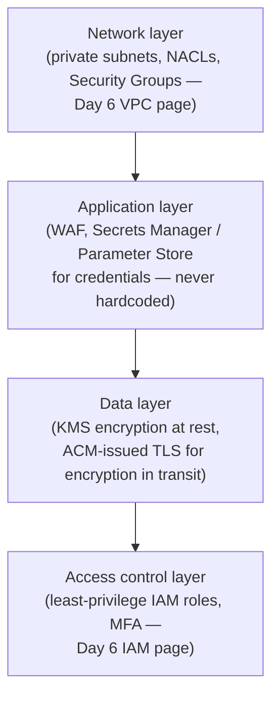

# Shared Responsibility Model & security architecture

## The one-line hook

> **"Managed" does not mean "secure by default" — and teams have genuinely shipped RDS instances sitting in public subnets with no encryption because someone assumed AWS managing the database engine meant AWS was also handling the security configuration around it.**

That specific trap was independently flagged across multiple sources as a real, common mistake — worth centering this entire page around it.

## The Shared Responsibility Model, precisely

AWS is responsible for **security OF the cloud** — physical infrastructure, hardware, the global network, and (for managed services) the host operating system and virtualization layer. The customer is responsible for **security IN the cloud** — data, IAM configuration, network and firewall configuration for unmanaged resources, and application-level security.

**The line genuinely moves depending on the service** — this is the specific, correct framing worth using directly, not a fixed 50/50 split:

| Service | Customer responsibility |
|---|---|
| **EC2** | Large — you manage the guest OS, patching, network configuration, IAM, and application security. AWS only handles the physical hardware and hypervisor layer. |
| **Lambda** | Small — AWS manages the entire runtime environment. You're responsible mainly for your code's security and the IAM permissions granted to the function. |
| **RDS** | Genuinely in between, and this is exactly where the trap lives — see below. |

## The specific trap: RDS is "managed," but not everything about it is AWS's job

AWS manages RDS's database engine patching and underlying hardware. But **security group rules, IAM permissions, whether the instance sits in a private subnet, and whether encryption at rest is enabled are all still the customer's responsibility** — none of that is automatic just because the service is "managed." This is precisely the trap that has led real teams to ship RDS instances in public subnets with no encryption, having assumed "managed" implicitly meant "secure by default."

**Memorable hook:** *"Managed means AWS handles the parts of the stack it controls. It has never meant AWS makes your configuration choices secure for you — those choices are still entirely yours, on every managed service, every time."*

## Defense in depth — consolidating the whole day's security material into one layered model

- **Network layer**: private subnets isolating tiers, NACLs as the stateless subnet-level firewall, Security Groups as the stateful instance-level firewall — directly recalling this same day's VPC networking page.
- **Application layer**: AWS WAF protecting against common web exploits, Secrets Manager or Parameter Store managing credentials and API keys — never hardcoded into application code.
- **Data layer**: KMS handling encryption at rest for databases and S3, ACM-issued TLS certificates handling encryption in transit.
- **Access control layer**: least-privilege IAM roles and enforced MFA, directly recalling this same day's IAM & identity architecture page.

## Preventive vs. detective controls — a distinction worth being precise about

Everything above is **preventive** — stopping a problem before it happens. A complete security posture also needs **detective controls**, for finding out whether something happened anyway:

- **CloudTrail** — logs every API action, the foundational "who did what, when" audit trail.
- **GuardDuty** — machine-learning-based threat detection, flagging unusual API call patterns, compromised credential behavior, or cryptomining activity.
- **AWS Config** — continuous configuration compliance monitoring, detecting drift away from a defined security baseline over time.

**Memorable hook:** *"Preventive controls are the locks on the doors. Detective controls are the security cameras — you need both, because locks alone don't tell you if one ever actually got picked."*

## A concrete incident response workflow, worth having ready as a complete answer

1. **CloudTrail** provides the API activity log to investigate.
2. **CloudWatch alarms** (often fed by GuardDuty findings) surface suspicious activity in near-real-time.
3. **IAM Access Analyzer** reviews external/cross-account access for anything unexpectedly broad.
4. On confirming a real incident: **rotate credentials**, **revoke active sessions**, and investigate at scale using **Athena** to run SQL queries directly against CloudTrail logs — far faster than manually paging through raw log files.

## Real-world examples

1. **The RDS-in-a-public-subnet-with-no-encryption trap, told directly as the real, documented mistake it is** — a strong, specific, cautionary example that directly closes the loop this day's IAM page opened, and shows genuine awareness of where "managed" assumptions actually go wrong in practice.
2. **A complete, layered defense-in-depth proposal for a Thai banking customer's application** — private subnets/NACLs/Security Groups at the network layer, WAF/Secrets Manager at the application layer, KMS/ACM at the data layer, least-privilege IAM/MFA at the access layer — synthesizing this entire day's VPC and IAM material into one coherent security architecture.
3. **Walking through the concrete incident response workflow** for a suspected compromised credential — CloudTrail, a GuardDuty-triggered alarm, Access Analyzer review, credential rotation and session revocation, then Athena-based investigation — a specific, operational, senior-level answer rather than a vague "we'd investigate and respond."
