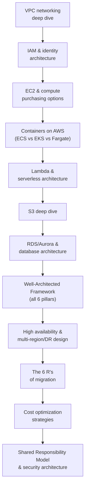

# Day 6 — AWS Core Architecture for Solutions Architects

## Why this day matters

This is the actual employer's own stack — expect the deepest, most specific questioning of the entire week here. Every source consulted while researching this day converged on the same point: AWS interviewers aren't scoring whether you know what S3 is. They're scoring whether you can state a real trade-off.

> "Junior answer: 'I'd use S3 because it's cheap and durable.' Senior answer: 'S3 Standard for the first 30 days, then lifecycle to Glacier Deep Archive, accepting a 12-hour retrieval SLA for the cost savings.'"

Every page today is built around giving you that second kind of answer, not the first.

## The mental model for the whole day

Today climbs from **the networking and identity foundation everything else sits on**, through **every major compute and storage choice** (with the tradeoffs that separate senior from junior answers), up through **the framework AWS itself uses to evaluate architecture** (Well-Architected), into **the judgment calls** (HA vs DR, migration strategy, cost), and closes with **the security model every AWS conversation eventually returns to**.

## Today's pages (10-hour day)

| # | Page | Approx. time |
|---|---|---|
| 1 | [VPC networking deep dive](01-vpc-networking-deep-dive.md) | 60 min |
| 2 | [IAM & identity architecture](02-iam-identity-architecture.md) | 55 min |
| 3 | [EC2 & compute purchasing options](03-ec2-compute-purchasing-options.md) | 45 min |
| 4 | [Containers on AWS — ECS vs EKS vs Fargate](04-containers-on-aws.md) | 50 min |
| 5 | [Lambda & serverless architecture](05-lambda-serverless-architecture.md) | 45 min |
| 6 | [S3 deep dive](06-s3-deep-dive.md) | 45 min |
| 7 | [RDS/Aurora & database architecture](07-rds-aurora-database-architecture.md) | 45 min |
| 8 | [The Well-Architected Framework, all 6 pillars](08-well-architected-framework.md) | 55 min |
| 9 | [High availability & multi-region/DR design](09-ha-multi-region-dr.md) | 50 min |
| 10 | [The 6 R's of migration](10-six-rs-migration.md) | 40 min |
| 11 | [Cost optimization strategies](11-cost-optimization.md) | 40 min |
| 12 | [Shared Responsibility Model & security architecture](12-shared-responsibility-security.md) | 40 min |
| 13 | [Interview Q&A drill](13-interview-qa.md) | 70 min, done cold, last |

## Real-world anchor for today

Today is unusual compared to the rest of the week: your resume shows the **AWS Certified Solutions Architect – Associate** certification and one directly AWS-based project — the **TnD Microservices platform** (Kafka, JMS, Docker, Kubernetes, **AWS**). That project is the anchor to reach for wherever a genuine connection exists, particularly for the Containers on AWS page (a direct extension of Day 1's Kubernetes material) and the HA/DR page. Where a topic goes beyond what that one project covered, ground the answer in the Well-Architected Framework's trade-off language rather than a hypothetical — that's the posture research showed actually being scored.
