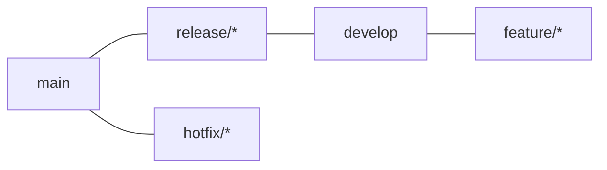

# Repository & branching workflow strategies

Branching strategy and repository structure are the two decisions that shape everything downstream — the CI/CD pipeline you build is largely a direct consequence of these two choices, not an independent decision made afterward.

## The one-line hook

> **Every branching strategy is really a different answer to one question: how long is code allowed to exist without being integrated into what everyone else is working from?** Git Flow says weeks. GitHub Flow says days. Trunk-Based Development says hours, or never at all.

## The four branching strategies, and what each demands of the pipeline

### Git Flow — heavyweight, versioned releases

Multiple long-lived branches: `main`, `develop`, `feature/*`, `release/*`, `hotfix/*` — a strong separation between in-progress and released work, built around **scheduled, versioned releases**.

**Pipeline design**: feature branches get CI only (build/test, no deploy). `develop` triggers deployment to a staging/integration environment. `release/*` branches get hardening and QA gates before promotion. Merges to `main` trigger production deployment and tagging. The pipeline has to treat different branches genuinely differently, not run one uniform flow.

**Fits**: products with distinct, discrete release versions — on-premises software, mobile apps bound to app-store review cycles. **Doesn't fit** continuous deployment well at all — the whole model assumes releases are periodic events, not a constant stream.

### GitHub Flow — the modern lightweight default

A single `main` branch plus short-lived feature branches. Every merge to `main` is deployable, and typically gets deployed (or is immediately deploy-ready).

**Pipeline design**: a pull request triggers CI (build/test); merging to `main` triggers CD straight to production, or a fast-follow staging-then-production promotion. Genuinely simple compared to Git Flow — one primary path, not several branch-type-specific ones.

**Fits**: continuous deployment, SaaS products, web applications — the reasonable default for most modern teams absent a specific reason to reach for something heavier.

### Trunk-Based Development — the highest-velocity extreme

Branches, if they exist at all, live for **hours, not days** — some teams commit directly to trunk. Incomplete work is hidden using **feature flags** rather than branch isolation — decoupling "deployed" from "visible to users," a direct connection to the feature-flag material this week's DevOps research repeatedly surfaced.

**Pipeline design**: the CI pipeline must be **fast and rock-solid reliable**, since everyone is integrating constantly — a slow or flaky pipeline doesn't just annoy one team, it blocks the entire trunk. Feature flags become a first-class pipeline concern, not an afterthought.

**Fits**: high-velocity teams, and effectively **required** at real scale for teams doing many production deploys per day — the Google/Facebook-style continuous deployment model doesn't function with long-lived branches at all.

**Memorable hook:** *"Git Flow manages risk by keeping unfinished work isolated in branches. Trunk-Based Development manages the exact same risk by keeping unfinished work isolated behind a flag instead — same goal, opposite mechanism."*

## Mono-repo vs. multi-repo (polyrepo) — a separate, largely independent decision

| | Mono-repo | Multi-repo (polyrepo) |
|---|---|---|
| **Structure** | All services/projects in one repository | Each service/project in its own repository |
| **Cross-service changes** | Atomic — one commit can touch multiple services at once | Requires coordinating separate PRs across multiple repos |
| **Versioning** | Typically unified | Independent per repo, own release cadence |
| **CI/CD complexity** | Grows with repo size — needs selective, path-based build triggering so a single commit doesn't rebuild and redeploy everything | Individual pipelines stay simple, but cross-repo dependencies need their own coordination mechanism |
| **Access control** | Coarser-grained by default | Finer-grained — natural repo-level boundaries |
| **Tooling need** | Real build-graph tooling (Bazel, Nx, Turborepo-style) to avoid full rebuilds | Package registries/versioned artifacts to manage inter-repo dependencies |

**The critical CI/CD design detail for a mono-repo**: without **path-based selective triggering** (only building/testing/deploying what actually changed, based on which paths a commit touched), a mono-repo's pipeline rebuilds and redeploys everything on every single commit — a serious, avoidable waste of time and risk that grows worse as the repo grows.

**The critical CI/CD design detail for a polyrepo**: a shared library or dependency living in its own repo needs an explicit mechanism (often a package registry publish event) to **trigger downstream repos' pipelines** when it changes — without this, downstream repos silently drift out of sync with an updated dependency.

## Branching strategy and repo structure are independent, but combine in recognizable patterns

- **Microservices + polyrepo + GitHub Flow or Trunk-Based** — the common modern default.
- **Mono-repo + Trunk-Based + heavy feature-flagging** — the "hyperscale" pattern (Google-style), where the build-graph tooling investment pays for itself at extreme scale.
- **Git Flow** tends to appear with either repo structure, but is most associated with versioned, non-continuously-deployed software specifically — the branching strategy, not the repo layout, is what signals a periodic-release mindset.

## Real-world examples

1. **The TnD Microservices platform is almost certainly a polyrepo** — one repository per decomposed service is the standard microservices practice — most likely paired with GitHub Flow or Trunk-Based branching given its cloud-native, Kubernetes/AWS-based architecture.
2. **The nbn iB2B platform, using the "Go Pipeline" tool listed on your resume, likely followed a more traditional Git Flow-style branching model** — consistent with the WebSphere/JBoss Fuse era and a versioned, scheduled release cadence typical of that generation of enterprise integration software. A genuinely interesting contrast showing how your own career spans both branching eras.
3. **Kong's own open-source repository structure**, directly relevant to your current role — a large, focused core repository for Kong Gateway itself, alongside a constellation of separate plugin repositories — a real, current, product-grounded example of exactly this repo-structure decision playing out at a company you know well.
