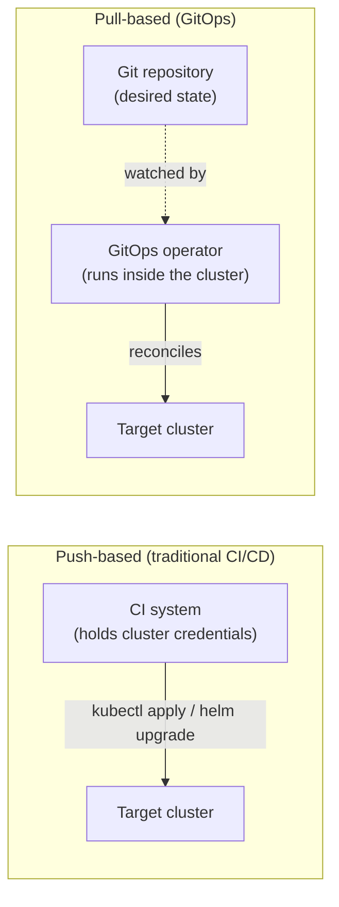

# GitOps deep dive — push vs pull

Research was unusually specific here: the real question isn't "what is ArgoCD," it's "explain the difference between push-based and pull-based deployment models and why it matters architecturally" — and the answer that actually passes is a security argument, not a topology description. This page is built to give you that exact answer, confidently.

## The one-line hook

> **Push-based CI/CD means your pipeline holds cluster credentials. Pull-based GitOps means it never has to — and that single difference is a genuine security posture improvement, not just a different workflow.**

## What GitOps actually is

**GitOps** uses Git as the single source of truth for declarative infrastructure and application configuration, with an **operator** continuously reconciling the live system's actual state toward whatever is declared in the repository.

## Push vs. pull, precisely

- **Push-based**: your CI system — a Jenkins job, a GitHub Actions workflow — runs `kubectl apply` or `helm upgrade` **directly** against the target cluster. For this to work at all, the CI system itself must hold real cluster credentials.
- **Pull-based (GitOps)**: an operator (ArgoCD, Flux) runs with access to the target cluster and **watches the Git repository**, pulling changes and reconciling the cluster toward what's declared there. **The cluster reaches out to Git — Git never reaches into the cluster.**

## The security argument — the exact answer worth having ready, word for word

Removing cluster credentials from the CI pipeline **reduces the blast radius of a pipeline compromise** in a way push-based deployment fundamentally cannot achieve. If a push-based CI system is compromised, the attacker directly inherits whatever cluster access that CI system held — genuine, immediate cluster credentials in an attacker's hands. In a pull-based model, the CI system **never held cluster credentials in the first place**, so compromising it doesn't hand over cluster access at all — the attacker would need to separately compromise the GitOps operator itself, a meaningfully different and narrower attack surface.

**Memorable hook:** *"In push-based CI/CD, your build pipeline is one compromise away from being your cluster's biggest attack surface. In pull-based GitOps, it isn't — because it was never holding the keys to begin with."*

## Other genuine GitOps benefits, worth naming beyond the security argument

- **Auditability** — every change is a Git commit, giving a complete, natural history of who changed what, when, and why (via commit messages and PR descriptions).
- **Easy rollback** — a `git revert` is all it takes; the operator automatically reconciles the cluster back to the reverted state, no separate rollback tooling needed.
- **Self-healing configuration drift** — if someone manually runs `kubectl edit` against a live resource, the operator detects the mismatch between the cluster's actual state and Git's declared state, and **reverts it back automatically**.

## The direct connection back to Day 1 — this is the same reconciliation loop, one layer up

This is worth stating explicitly and confidently: **GitOps is the exact same reconciliation loop pattern built from scratch on Day 1** for Kubernetes' own `kube-controller-manager` — compare desired state against actual state, and continuously correct any mismatch — just applied one layer higher, at the whole-deployment-pipeline level instead of inside the Kubernetes control plane itself.

**Going one step further**: ArgoCD and Flux are themselves typically implemented **as Kubernetes Operators** — a custom resource (an `Application` in ArgoCD, a `Kustomization` in Flux) paired with a controller that reconciles it. This is the same Operator pattern that's resurfaced repeatedly this week — Day 1's AMQ Streams example, Day 2's Camel K — appearing again here, for the fourth or fifth time, as GitOps tooling itself.

**Memorable hook:** *"GitOps isn't a new idea layered on top of Kubernetes — it's Kubernetes' own reconciliation philosophy, recognizing that the same trick works for deploying the applications, not just running them."*

## ArgoCD vs. Flux — and the honest self-assessment that matters more than picking a side

Both are legitimate, pull-based GitOps operators for Kubernetes. The genuinely important interview guidance here: **if you know one deeply and the other only conceptually, say exactly that.** An interviewer with a tool preference is often specifically checking whether a candidate will claim false expertise rather than testing which tool is objectively "correct" — honesty about the boundary of your hands-on experience reads as more senior than confidently overstating it.

## Real-world examples

1. **Delivering the exact security-posture answer directly and confidently** — this is precisely the answer research identified as the one that separates a real production understanding from tutorial-level familiarity, so it's worth having ready essentially verbatim.
2. **Explicitly naming that ArgoCD/Flux are themselves Kubernetes Operators, and that GitOps is the same reconciliation loop from Day 1's `kube-controller-manager` material, just one layer up** — a maximally strong, cross-day, pattern-recognizing answer that shows the whole week connecting.
3. **Diagnosing configuration drift** — a live resource manually edited via `kubectl edit`, automatically detected and reverted by ArgoCD or Flux's continuous reconciliation — a concrete, realistic operational scenario demonstrating GitOps's self-healing property in practice, not just in theory.
