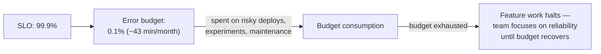

# SLI/SLO & SRE fundamentals

## The one-line hook

> **An error budget is the mechanic that turns "ship faster vs. be more careful" from an endless political argument into a data-driven, automatic decision — and it's the single idea that ties this entire day's velocity themes (CI/CD, GitOps) and Day 5's reliability themes together into one coherent system.**

## Site Reliability Engineering, briefly

**SRE**, pioneered at Google, treats operations as a software engineering problem — applying the same rigor, automation, and measurement discipline to keeping systems reliable that's normally applied to building features.

## SLI, SLO, and SLA — three related but genuinely distinct terms

| Term | What it is | Example |
|---|---|---|
| **SLI** (Service Level Indicator) | A specific, quantitative, directly measurable aspect of service behavior | Request latency, error rate, availability |
| **SLO** (Service Level Objective) | An internal target for an SLI over a defined period | "99.9% of requests complete in under 200ms, over a rolling 28-day window" |
| **SLA** (Service Level Agreement) | A contractual, customer-facing promise, usually with financial consequences if breached | "99.5% uptime, or the customer receives a service credit" |

**The precise relationship worth having exactly right**: an SLA should generally be set **looser** than the internal SLO — giving genuine operating margin to notice and fix a problem internally before it ever becomes a customer-facing, financially consequential breach. If your SLA and SLO are identical, you have zero room to catch and fix a problem before it costs you contractually.

**Memorable hook:** *"The SLO is the bar you actually try to clear. The SLA is the bar you promised a customer, set deliberately lower, so a stumble against the SLO doesn't automatically mean breaking a contract."*

## Error budgets — the mechanic that actually matters

An SLO of 99.9% implies a **0.1% error budget** — roughly 43 minutes of acceptable downtime per month. This budget can be **spent** deliberately: on risky deploys, on experiments, on planned maintenance windows. The genuinely powerful organizational mechanic: **when the error budget is exhausted, the team stops shipping new features and shifts entirely to reliability work** until the budget recovers.

**Memorable hook:** *"An error budget turns 'should we ship this risky change' from a subjective argument into an objective, pre-agreed answer — you have budget, or you don't, and everyone already agreed on the rule before the argument ever needed to happen."*

## Choosing good SLIs — a real design skill

A good SLI reflects **actual user experience**, not merely whatever happens to be convenient to measure. CPU utilization is easy to instrument, but it's not what a user actually experiences — request success rate and request latency are much closer to what a user genuinely feels. Google's SRE book offers a standard starting framework worth naming: the **four golden signals** — **Latency, Traffic, Errors, Saturation** — a well-known, reasonable default lens for choosing what to actually measure.

## Toil — the term worth defining precisely

**Toil** is manual, repetitive, automatable operational work that scales linearly with service growth and provides no lasting engineering value — the opposite of the automation-first instinct running through this entire day (CI/CD, GitOps, IaC all exist, in part, specifically to reduce toil). SRE philosophy famously caps how much of an engineer's time should go to toil (Google's well-known guideline: no more than roughly half), with the remainder deliberately protected for genuine engineering work — building the automation and tooling that reduces *future* toil, not just handling today's.

## Burn-rate alerting — the mature version of the previous page's alert fatigue checklist

The previous page's "integrate context" alert-fatigue mitigation is, in its most mature form, exactly this: alerting on the **rate at which the error budget is being consumed**, not a static threshold. "We're burning the monthly error budget fast enough to exhaust it within 2 hours if this continues" is a dramatically more actionable, more urgent signal than "CPU crossed 80%" — it directly ties the alert to actual customer-facing consequence, which is the whole point of choosing good SLIs in the first place.

## Real-world examples

1. **Setting a genuine SLO for a Kong-fronted API**, directly relevant to your current role — 99.9% request success rate measured over a rolling window, with Kong itself (already covered in depth on Day 3) being a natural, concrete place to actually measure the underlying SLI at the edge.
2. **An error budget policy as the mechanism resolving this entire course's velocity-vs-reliability tension** — "when the error budget is exhausted, feature work stops and reliability work takes over" is a sophisticated answer showing that SRE philosophy isn't a separate topic, it's the organizational mechanism that ties CI/CD velocity (this day) and resilience engineering (Day 5) together into one coherent, self-regulating system.
3. **Burn-rate alerting for a Thai banking customer's critical transaction API**, tied to actual SLOs rather than arbitrary CPU or memory thresholds — a mature, business-aligned alerting recommendation directly building on the previous page's alert-fatigue material with a concrete, regulated-industry example.
