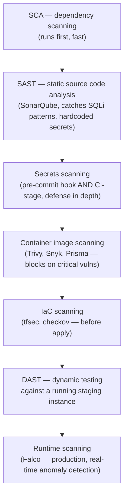

# DevSecOps — shift-left security pipeline

## The one-line hook

> **Shift-left means security becomes everyone's job, embedded in the pipeline itself — not a gate at the end run by a separate team, and the specific stage placement (what runs early and fast vs. late and thorough) is itself the actual architecture decision being tested.**

## The full pipeline, stage by stage

### SCA — why it runs first

**Software Composition Analysis** scans third-party dependencies for known vulnerabilities. Research specifically flagged *why prioritize SCA first* as a real interview question — the honest answer: the large majority of real-world vulnerabilities in modern applications come from **dependencies**, not first-party code, so catching a known-vulnerable library early has the highest signal-to-effort ratio of any stage in the pipeline.

### SAST — fast, static, source-level

**Static Application Security Testing** (SonarQube is the commonly named tool) analyzes source code **without running it**, catching patterns like SQL injection risks, hardcoded secrets, and insecure cryptographic usage. It runs early and fast, directly in CI, since it needs no running environment at all.

### Secrets scanning — defense in depth, at two points

Catching secrets accidentally committed to a repository needs **both** a pre-commit hook (stopping it before it ever reaches the remote repo) **and** CI-stage scanning (catching anything that slipped past the hook anyway) — genuine defense in depth, not either one alone.

### Container image scanning — block, don't just report

Scanning built images for known vulnerabilities in OS packages and layers (Trivy, Snyk, Prisma Cloud). The critical design detail: this should actually **block deployment** on critical findings, not merely generate a report someone might read later.

### IaC scanning — before `apply`, not after

Tools like **tfsec** and **checkov** scan Terraform (or CloudFormation) for security misconfigurations *before* anything is actually provisioned — catching an accidentally public S3 bucket or an overly permissive security group rule before it ever exists, directly extending Day 6's S3 and IAM security material into the pipeline itself.

### DAST — testing the running thing, not just the source

**Dynamic Application Security Testing** simulates actual attacks against a genuinely **running** instance (typically staging), catching real, exploitable runtime issues that SAST's static source-level view simply cannot see — configuration problems, actual reachability of a vulnerability, not just its theoretical presence in code.

### Runtime scanning — the last line of defense

**Falco** (the specifically named tool from research) monitors actual running production workloads for anomalous or malicious behavior in real time — the final safety net for anything every earlier, pre-deploy stage missed.

## Container security — a concrete checklist, directly tying back to Day 1

- **Minimal base images** — distroless or Alpine, reducing the attack surface to as little as genuinely necessary.
- **Image signing and signature verification at deploy time** — genuine supply-chain integrity, ensuring only images that actually passed through the proper pipeline can be deployed at all, a real defense against a tampered or substituted image.
- **Read-only root filesystems** where possible.
- **Non-root users inside containers** — this is worth stating explicitly as **the exact same discipline Day 1 built from first principles**: dropping Linux capabilities down to only what's genuinely needed, now enforced as a pipeline-checked policy rather than a one-off configuration choice.

## Secrets management, done right

Never in code, never in the repository, never baked into an image — inject secrets at **runtime** from a dedicated secrets manager (HashiCorp Vault, or a cloud-native equivalent like AWS Secrets Manager, directly connecting to Day 6), scoped to only the specific jobs or roles that genuinely need them, rotated regularly, and — a specific, easy-to-overlook operational detail — never echoed into logs, where they'd sit in plaintext indefinitely regardless of how carefully they were injected.

## The "break-glass" process — a mature, worth-naming nuance

A defined, **audited** process for deliberately bypassing normal security gates during a genuine active incident, when speed matters more than the standard process. This is **not** a routine way to skip security — it's a deliberate, logged exception mechanism for real emergencies specifically. Naming this shows a mature understanding that security is meant to be a **partner** to engineering velocity, not an inflexible blocker in every circumstance without exception — directly addressing the "gatekeeper vs. enabler" framing research raised repeatedly.

## Real-world examples

1. **A complete DevSecOps pipeline design for a Thai financial services customer** — SCA, SAST, and secrets scanning running early and fast; container and IaC scanning at build time; DAST against staging; Falco-style runtime monitoring in production — a comprehensive, credible answer synthesizing this entire page into one coherent pipeline.
2. **The non-root container discipline directly connecting back to Day 1's "building a container from scratch" page** — the exact same capabilities-dropping principle, now enforced as a pipeline-checked security policy rather than a one-off manual configuration choice, a strong explicit cross-day connection.
3. **Explaining a break-glass process for a genuine production incident** requiring a hotfix to bypass normal security gates — a mature, nuanced answer demonstrating security-as-enabler thinking rather than security-as-absolute-blocker.
