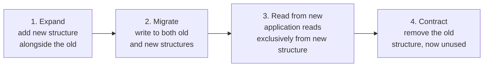

# Safe deployment patterns

## The one-line hook

> **Blue-green, canary, and rolling deployment are really the same question asked three different ways: how much of the blast radius do I expose at once, and how fast can I undo it if something's wrong — the exact same spectrum Day 5 covered for resilience patterns generally, now applied specifically to the moment of deployment itself.**

## Blue-green deployment

Two identical environments — **blue** (current, live) and **green** (the new version) — with the new version deployed fully to green, tested, and then traffic switched **all at once** via a load balancer, DNS change, or router switch.

- **Strength**: extremely fast rollback — just switch traffic back to blue.
- **Cost**: genuinely requires double the infrastructure during the transition window, and any stateful or database changes need careful handling, since both environments may briefly need to work against the same or compatible data.

## Canary deployment

Gradually shift a **small percentage** of traffic to the new version — 5%, monitor, 25%, monitor, 100% — watching error rates and latency at each step, rolling back automatically or manually if metrics degrade.

- **Strength**: dramatically lower blast radius — only a fraction of users are ever exposed to a bad deploy at any given moment.
- **Cost**: slower to reach full rollout, and genuinely requires real traffic-splitting infrastructure — directly recalling **Day 3's API Gateway and Service Mesh traffic-splitting capabilities**, and Day 6's ALB weighted target groups, to actually implement the gradual shift.

## Rolling deployment — the Kubernetes default

Old pod instances are gradually replaced with new ones, a few at a time, with health checks gating progression to the next batch.

- **Strength**: no extra infrastructure needed, unlike blue-green's doubled footprint.
- **Cost**: rollback is slower, since it has to happen the same gradual way — and critically, there's a real period where **old and new versions run simultaneously**, meaning API and schema compatibility across that window is not optional, it's a hard requirement.

**Memorable hook:** *"Blue-green trades infrastructure cost for instant rollback. Canary trades rollout speed for a smaller blast radius. Rolling trades rollback speed for needing no extra infrastructure at all — there's no free option, just three different bills to pay."*

## Feature flags — decoupling deployment from release, revisited

Directly extending this same day's branching strategy page: a feature flag separates **deployment** (the code is running in production) from **release** (the feature is actually visible or active for users) — enabling an instant "rollback" that's really just flipping a flag off, no redeploy needed at all, plus A/B testing and gradual per-user-cohort rollout entirely independent of the infrastructure-level mechanics above.

**The honest operational cost worth naming**: **flag debt** — old flags that never get cleaned up accumulate real complexity over time — and genuinely increased testing complexity, since more flag combinations mean more code paths that actually need verifying.

## Database migration safety — the expand-and-contract pattern

**Never perform a destructive schema change — dropping a column, renaming a table — in a single step.** The standard, safe pattern instead:

1. **Expand** — add the new structure (a new column, a new table) without removing anything yet.
2. **Migrate** — deploy code that writes to **both** the old and new structures simultaneously.
3. **Read from new** — deploy code that reads exclusively from the new structure.
4. **Contract** — only once nothing depends on the old structure anymore, remove it.

**Why this exists, precisely**: every single step stays backward-compatible, meaning a rollback at **any point** in the process never requires rolling back the database too — a hugely important operational property, since database rollbacks are far riskier and slower than application rollbacks. Versioned, idempotent migration tools (Flyway, Liquibase, Rails migrations, Alembic) are the standard mechanism for running this safely and repeatably.

**The direct connection worth stating**: **migrations should run before deploying new application code**, not simultaneously with it — so that rolling back the application alone, without touching the database, remains a safe, complete rollback on its own.

## Real-world examples

1. **Recommending canary deployment via Kong's traffic-splitting capabilities** for a customer's critical payment API — directly recalling Day 3's Kong material — monitoring real-time error rate and latency at each traffic-percentage step before proceeding further, a concrete, product-grounded, directly current-role-relevant example.
2. **The expand-and-contract pattern applied to an actual schema change** — renaming a column in a customer's production database — a specific, technically complete answer demonstrating genuine database-change discipline, not just naming the pattern.
3. **Feature flags as the concrete mechanism enabling Trunk-Based Development**, directly tying this page back to this same day's branching strategy page — showing the whole day's material connecting into one coherent story about how code safely travels from a developer's laptop to production.
