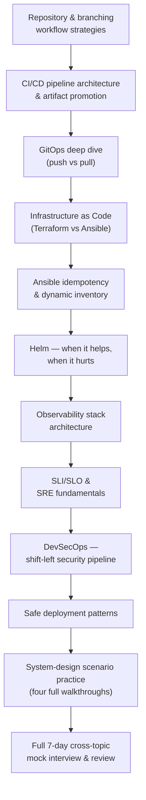

# Day 7 — DevOps/DevSecOps & Full Review

## Why this day matters

This is the last day, and it closes two loops at once. First: DevOps/DevSecOps questions are where interviewers test whether you understand *why* a practice exists, not just its name — research was unusually blunt about this: "Kubernetes orchestrates containers" isn't a useful answer; "Kubernetes is overkill for a 3-service startup and I'd use ECS instead" is. Second: this whole week has been organized as seven separate days, but a real interview won't respect those boundaries — a single scenario question can easily need Day 1's containers, Day 4's messaging, and Day 6's AWS architecture all at once. Today's two closing pages — four rehearsed system-design scenario shapes, then a full cross-topic mock — are built specifically to force that integration before the real interview does it for you, live.

## The mental model for the whole day

Today climbs from **how code and infrastructure changes actually flow through a team** (branching, CI/CD, GitOps, IaC), through **the operational disciplines that keep a deployed system healthy** (observability, SLOs, security), into **the patterns that make deployment itself safe**, and closes with **the whole week, deliberately mixed together**.

## Today's pages (10-hour day)

| # | Page | Approx. time |
|---|---|---|
| 1 | [Repository & branching workflow strategies](01-repo-branching-workflow-strategies.md) | 60 min |
| 2 | [CI/CD pipeline architecture & artifact promotion](02-cicd-pipeline-architecture.md) | 45 min |
| 3 | [GitOps deep dive — push vs pull](03-gitops-push-vs-pull.md) | 55 min |
| 4 | [Infrastructure as Code — Terraform vs Ansible](04-iac-terraform-vs-ansible.md) | 45 min |
| 5 | [Ansible idempotency & dynamic inventory](05-ansible-idempotency-inventory.md) | 45 min |
| 6 | [Helm — when it helps, when it hurts](06-helm-when-it-helps-hurts.md) | 40 min |
| 7 | [Observability stack architecture](07-observability-stack-architecture.md) | 50 min |
| 8 | [SLI/SLO & SRE fundamentals](08-sli-slo-sre-fundamentals.md) | 45 min |
| 9 | [DevSecOps — shift-left security pipeline](09-devsecops-shift-left-security.md) | 50 min |
| 10 | [Safe deployment patterns](10-safe-deployment-patterns.md) | 45 min |
| 11 | [System-design scenario practice — four full walkthroughs](11-system-design-scenarios.md) | 75 min, done out loud |
| 12 | [Full 7-day cross-topic mock interview & review](12-full-mock-interview-review.md) | 90 min, the capstone |

The two closing pages are the day's real workload — if the technical pages run long, compress them rather than the scenarios and mock, which only work done cold and out loud.

## Real-world anchor for today

This day draws on your Red Hat presales background (CI/CD and GitOps positioning conversations were a real part of that role) and your Marlo/nbn integration work (Go Pipeline and Ansible are explicitly on your resume for the iB2B platform) more evenly than any single project. The final page is different from every other page this week — it isn't anchored to one project at all. It's anchored to the *whole* week, deliberately.
